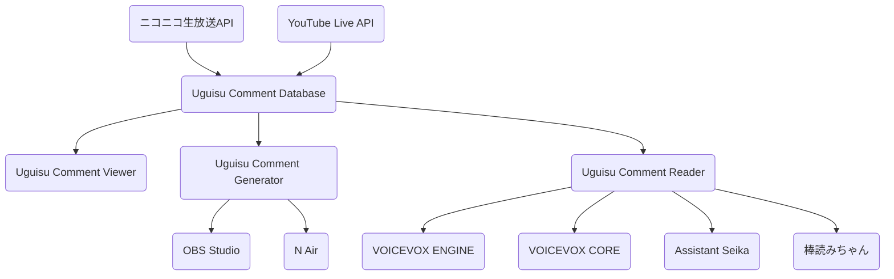

# 構想

## 検討事項

- プラグインの形態をとるとメンテナンスが大変
- サービス間のコメント仕様の差異の吸収

## コード基盤を共通化するにはどうしたらいいか？

要件

- モバイルを含むマルチプラットフォーム対応
- ネイティブで動くアプリケーション（非公式APIを利用する都合、CORS等の関係上）

不慣れだけれど、全部Dartで実装するしかないか...？

## アーキテクチャ

## コメントモデル

- 共通データ
  - コテハン
- ニコニコ動画
  - ユーザID
  - プロフィール名
  - 184
  - プレミアム会員
  - ギフト
  - ニコニ広告
  - エモーション
  - 来場者通知
  - 好きなものリスト登録
- YouTube
  - チャンネルID
  - チャンネル名
  - モデレータ
  - スーパーチャット
